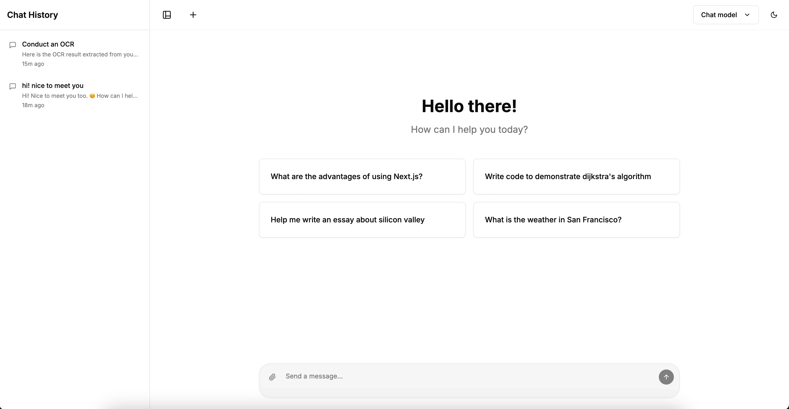
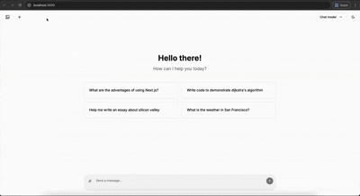

# Nexus – AI-Powered Chat Interface

[](LICENSE) [](https://nextjs.org/) [](https://openai.com)

<p align="center">
  
</p>

> **✨ AI Vibe coded:** This entire project was conceived & generated with the help of generative AI tools. Welcome to the future of collaborative software creation!

Nexus is a modern, secure and **multimodal** chat interface that lets you talk to OpenAI's latest models, share files, and keep your conversation history – all wrapped in a beautiful light/dark UI built with **Next.js 14**, **TypeScript**, **Tailwind CSS**, and **shadcn/ui**.

---

## Table of Contents

1. [Features](#features)
2. [Live Demo](#live-demo)
3. [Getting Started](#getting-started)
4. [Usage](#usage)
5. [Project Structure](#project-structure)
6. [Configuration](#configuration)
7. [Contributing](#contributing)
8. [Roadmap](#roadmap)
9. [License](#license)
10. [Acknowledgements](#acknowledgements)

---

## Features

- 🌗 **Elegant Light & Dark Themes** – Theme switcher with smooth animations.
- 🧠 **Full OpenAI Model Support** – Works with any OpenAI model through custom Assistants (GPT-4o, GPT-4, GPT-3.5-turbo, etc.) with streaming responses.
- 📁 **Multimodal Uploads** – Ask questions about images or documents (PNG, JPG, WEBP, PDF, TXT, MD, …).
- 🕑 **Quick Chat Access** – Only thread IDs are stored locally (cookie & localStorage) so you can resume chats; your actual messages never leave the server.
- ⚡️ **Server-Side Rendering** – Fully SSR via Next.js 14; chat history sidebar and theme preference are rendered on the server for snappy loads.
- 🔒 **Secure Server Routes** – Your OpenAI API key never touches the client.
- 📱 **Responsive** – Optimised for desktop & mobile.
- 🔄 **Abort / Regenerate** – Stop responses mid-way or start over.
- 🪄 **AI Vibe Coded** – Built rapidly with the assistance of generative AI.

---

## Live Demo

*No public demo is hosted.* Please clone & run locally (see instructions below). Example screenshots / GIFs are provided purely for showcase.

<p align="center">
  
</p>

*Place your own screenshots in `docs/` (or update the paths above) once you have them.*

---

## Getting Started

### Prerequisites

- **Node.js ≥ 18.19.0** (exact version used during development)
- **npm** or **yarn**
- An **OpenAI API key** – create one at <https://platform.openai.com/api-keys>
- An **OpenAI Assistant ID** – create / copy one from <https://platform.openai.com/assistants>

### Installation

```bash
# 1. Clone the repo
$ git clone https://github.com/YOUR_GITHUB_USERNAME/nexus-chat.git
$ cd nexus-chat

# 2. Install dependencies
$ npm install   # or: yarn install

# 3. Configure environment
$ cp .env.local.example .env.local
# then edit .env.local and add:
# OPENAI_API_KEY=sk-...
# OPENAI_ASSISTANT_ID=your_assistant_id

# 4. Run the dev server
$ npm run dev   # or: yarn dev

# 5. Open your browser
# http://localhost:3000
```

### Deployment

Nexus is production-ready and **works out-of-the-box on Vercel**. Simply:

1. Push your fork to GitHub.
2. Import the repository in Vercel.
3. Add the `OPENAI_API_KEY` and `OPENAI_ASSISTANT_ID` environment variables.
4. Click **Deploy**.

(Other platforms like Netlify or traditional VPS hosting also work – just serve the built Next.js output.)

---

## Usage

1. **Start a new chat** or pick an existing conversation from the sidebar.
2. **Type a prompt** and watch the assistant stream its response.
3. **Upload files** by clicking the paper-clip icon – supported types are fetched dynamically from `/api/supported-types`.
4. **Stop** the response at any time with the stop icon.
5. **Copy** messages, **report** issues, or **delete** chats with a single click.

> Tip: You can link directly to a chat with `/chats/{threadId}` – perfect for sharing!

---

## Project Structure

```
├─ app/                 # Next.js Server & App Router
│  ├─ api/              # Edge-ready Server Actions (chat, upload, …)
│  └─ ...
├─ components/          # Re-usable UI (shadcn/ui wrapped components)
├─ hooks/               # Custom React hooks (use-chat, use-file-upload, …)
├─ lib/                 # Utility libraries (chat-history, theme, …)
├─ views/               # High-level screens (AppScreen, ChatScreen)
├─ public/              # Static assets (screenshots, favicons, …)
└─ README.md            # You are here 😉
```

---

## Configuration

| Name | Default | Description |
| ---- | ------- | ----------- |
| `OPENAI_API_KEY` | – | **Required.** Your secret OpenAI key, stored server-side. |
| `NEXT_PUBLIC_OPENAI_MODEL` | `gpt-4o` | Default model used when chatting. |
| `OPENAI_ASSISTANT_ID` | – | **Required.** ID of the Assistant you want to chat with. |

Customise colours in `lib/theme-config.ts`, supported file types in `app/api/supported-types/route.ts`, and Tailwind settings in `tailwind.config.ts`.

---

## Contributing

Contributions are **welcome and appreciated**! 💖

1. Fork the repo & create your branch `git checkout -b feature/awesome`.
2. Commit your changes `git commit -m 'Add awesome feature'`.
3. Push to the branch `git push origin feature/awesome`.
4. Open a Pull Request.

Please follow the existing code style and **open an issue** first for large changes.

---

## Roadmap

- [ ] Better mobile UX (gesture navigation)
- [ ] Multiple model support (vision, audio)
- [ ] Plugin / tool integration
- [ ] i18n – multi-language interface
- [ ] Automated unit & integration **tests**
- [ ] Anything *you* suggest 🙌

---

## License

This project is released under the [MIT License](LICENSE). You're free to use, modify, and distribute it with proper attribution.

---

## Acknowledgements

- [Next.js](https://nextjs.org/)
- [OpenAI](https://openai.com/)
- [Tailwind CSS](https://tailwindcss.com/)
- [shadcn/ui](https://ui.shadcn.com/)
- [clsx](https://github.com/lukeed/clsx) & [tailwind-merge](https://github.com/dcastil/tailwind-merge)
- All the brilliant people building tools that supercharge developers ❤

---

<p align="center">Made with ☕ &nbsp;and lots of <strong>AI Vibe</strong>!</p>